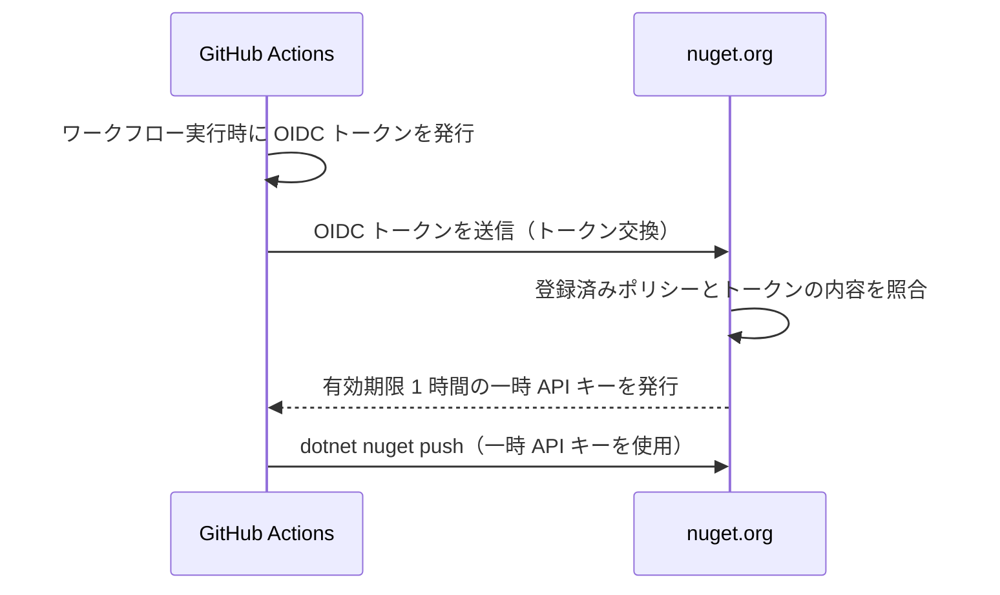

# NuGet 公開手順（Trusted Publishing）

本リポジトリは **NuGet Trusted Publishing (OIDC)** を利用して nuget.org へ公開します。
長期 API キーや GitHub Secrets は **一切使用しません**。

## 仕組み

- 一時 API キーの有効期限は **1 時間**。そのため `publish.yml` では push の直前にキーを取得します。
- 1 つの OIDC トークンにつき API キーは 1 つだけ発行されます。

## 初回セットアップ（1 回だけ実施）

### 1. nuget.org で Trusted Publishing ポリシーを登録

1. <https://www.nuget.org/> にサインインします。
2. 右上のユーザー名 → **Trusted Publishing** を選択します。
3. **Add a new trusted publishing policy** を押下し、以下を入力します（大文字小文字は区別されません）。

| 項目 | 設定値 | 補足 |
| --- | --- | --- |
| Repository Owner | `tomokuni` | GitHub のオーナー名 |
| Repository | `EsUtil.Helper.ZenHanConverter` | GitHub のリポジトリ名 |
| Workflow File | `publish.yml` | **ファイル名のみ**。`.github/workflows/` は含めない |
| Environment | （空欄） | 本リポジトリのワークフローは GitHub Environment を使用しないため空欄 |

4. **Policy Scopes** で、対象パッケージの glob パターンを指定します。
   本リポジトリは新規パッケージのため、**新規パッケージの公開を許可**する必要があります。

   例: `EsUtil.Helper.ZenHanConverter`

5. **Policy Owner** には、パッケージを所有するアカウント（個人または組織）を選択します。選択した Owner が所有するすべてのパッケージにポリシーが適用されます。

> **補足（Private リポジトリの場合）**
> ポリシー作成直後は「7 日間だけ有効な一時状態」になることがあります。
> これは GitHub のリポジトリ ID / オーナー ID を nuget.org がまだ取得できていないためで、
> 最初の公開が成功すると恒久的に有効化されます。
> 7 日以内に公開できなかった場合は、UI から 7 日間の期間を再開できます。

### 2. GitHub 側の確認

- **Secrets の登録は不要です。** 既存の `NUGET_API_KEY` がある場合は削除して構いません。
- ワークフローが `id-token: write` 権限を持っている必要があります（`publish.yml` に設定済み）。

## 公開の実行

### 通常の公開（バージョンアップ時）

1. `src/ZenHanConverter.csproj` の `<Version>` を更新します。
2. `main` ブランチへ push します。
3. GitHub Actions の **Publish to NuGet** が自動実行され、ビルド → pack → タグ作成 → GitHub Release 作成 → nuget.org へ push まで実行されます。

### 手動での再実行

`workflow_dispatch` に対応しているため、失敗後の再公開が可能です。

- GitHub の **Actions** タブ → **Publish to NuGet** → **Run workflow** を押下します。
- または失敗した実行の画面で **Re-run all jobs** を押下します。

### 公開可否の判定（冪等）

`publish.yml` は「最新タグとの比較」ではなく、**`artifacts/` の各パッケージが nuget.org に未公開かどうか**で公開対象を判定します。

そのため、途中のステップで失敗した場合でも、原因を解消して再実行すれば **未公開分だけ** が正しく公開されます。

| 状況 | 動作 |
| --- | --- |
| 未公開バージョン | タグ作成 → Release 作成 → push |
| 公開済みバージョン | Git タグ作成をスキップし、Release のみ更新。nuget.org へは push しない |

## トラブルシューティング

| 症状 | 原因と対処 |
| --- | --- |
| `NuGet/login` で `403` / `unauthorized` | nuget.org のポリシー未登録、または Owner / Repository / Workflow File の不一致。`Workflow File` は `publish.yml` のようにファイル名のみを指定します。 |
| `user` の指定誤り | `NuGet/login@v1` の `user` は **nuget.org のプロファイル名**です。メールアドレスではありません。 |
| push で `409 Conflict` | 同一バージョンが既に公開済み。`<Version>` を上げてください（`--skip-duplicate` により重複はスキップされます）。 |
| 一時 API キーの期限切れ | キー取得から push までが 1 時間を超えています。ワークフローでは push 直前に取得する構成にしています。 |
| ポリシーが `Inactive` | ポリシーの Owner から外れた、または Owner の組織が無効化された可能性があります。UI の警告を確認してください。 |
