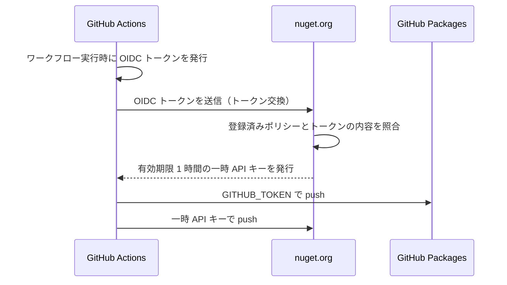

# リリース手順（NuGet.org / GitHub Packages）

本リポジトリは以下の 2 つのレジストリへ公開します。**どちらも長期 API キーや GitHub Secrets の登録は不要**です。

| レジストリ | 認証方式 | 必要な設定 |
| --- | --- | --- |
| NuGet.org | **Trusted Publishing (OIDC)** | nuget.org のポリシー登録（初回のみ） |
| GitHub Packages | **`GITHUB_TOKEN`** | 不要（`packages: write` 権限を使用） |

## 仕組み



- NuGet.org の一時 API キーの有効期限は **1 時間**。そのため `publish.yml` では push の直前にキーを取得します。
- 1 つの OIDC トークンにつき API キーは 1 つだけ発行されます。
- GitHub Packages へは `--skip-duplicate` を付けて **常に** push します。これにより「NuGet.org には公開済みだが GitHub Packages には未公開」という取りこぼしを防ぎます。

## 初回セットアップ（1 回だけ実施）

### 1. NuGet.org で Trusted Publishing ポリシーを登録

1. <https://www.nuget.org/> にサインインします。
2. 右上のユーザー名 → **Trusted Publishing** を選択します。
3. **Add a new trusted publishing policy** を押下します。
4. **Policy Scopes** で、対象パッケージの glob パターンを指定します。本リポジトリは新規パッケージのため、**新規パッケージの公開を許可**する必要があります。
5. **Policy Owner** には、パッケージを所有するアカウント（個人または組織）を選択します。選択した Owner が所有するすべてのパッケージにポリシーが適用されます。

#### 入力値

| 項目 | 設定値 | 補足 |
| --- | --- | --- |
| Repository Owner | `tomokuni` | GitHub のオーナー名 |
| Repository | `EsUtil.Helper.ZenHanConverter` | GitHub のリポジトリ名 |
| Workflow File | `publish.yml` | **ファイル名のみ**。`.github/workflows/` は含めない |
| Environment | （空欄） | 本リポジトリのワークフローは GitHub Environment を使用しないため空欄 |

Policy Scopes の例: `EsUtil.Helper.ZenHanConverter`

> **補足（Private リポジトリの場合）**
> ポリシー作成直後は「7 日間だけ有効な一時状態」になることがあります。
> これは GitHub のリポジトリ ID / オーナー ID を nuget.org がまだ取得できていないためで、
> 最初の公開が成功すると恒久的に有効化されます。
> 7 日以内に公開できなかった場合は、UI から 7 日間の期間を再開できます。

### 2. GitHub 側の確認

- NuGet.org 用の **Secrets の登録は不要です。** 既存の `NUGET_API_KEY` がある場合は削除して構いません。
- ワークフローが `id-token: write` と `packages: write` を持っている必要があります（`publish.yml` に設定済み）。
- GitHub Packages へは `GITHUB_TOKEN` で認証するため、追加の設定は不要です。

### 3. GitHub Packages の可視性（任意）

GitHub Packages は **初回公開時の可視性が Private** です。
広く配布する場合は、パッケージのページから可視性を Public に変更してください。

- 対象: <https://github.com/tomokuni/EsUtil.Helper.ZenHanConverter/pkgs/nuget/EsUtil.Helper.ZenHanConverter>

> `.csproj` の `<RepositoryUrl>` が本リポジトリを指しているため、パッケージは自動的にリポジトリへリンクされます。
> これによりワークフローはパッケージへの `admin` 権限を自動的に得ます。

## 公開の実行

### 通常の公開（バージョンアップ時）

1. `src/ZenHanConverter.csproj` の `<Version>` を更新します。
2. `README.md` の **GitHub Packages バッジのバージョン表記** を新しい値に更新します（後述）。
3. `main` ブランチへ push します。
4. GitHub Actions の **Publish** が自動実行され、ビルド → pack → GitHub Packages へ push → タグ作成 → GitHub Release 作成 → NuGet.org へ push まで実行されます。

### 手動での再実行

`workflow_dispatch` に対応しているため、失敗後の再公開が可能です。

- GitHub の **Actions** タブ → **Publish** → **Run workflow** を押下します。
- または失敗した実行の画面で **Re-run all jobs** を押下します。

### 公開可否の判定（冪等）

`publish.yml` は「最新タグとの比較」ではなく、**`artifacts/` の各パッケージが nuget.org に未公開かどうか**で NuGet.org への公開対象を判定します。
そのため、途中のステップで失敗した場合でも、原因を解消して再実行すれば **未公開分だけ** が正しく公開されます。
GitHub Packages へは常に push しますが `--skip-duplicate` により既存バージョンはスキップされます。

| 状況 | NuGet.org | GitHub Packages |
| --- | --- | --- |
| 未公開バージョン | タグ作成 → Release 作成 → push | push |
| 公開済みバージョン | 何もしない | 既存のためスキップ |

## README のバッジについて

| バッジ | 種類 | 備考 |
| --- | --- | --- |
| `release` | 動的（shields.io） | GitHub Release の最新タグを表示 |
| `nuget` | 動的（shields.io） | NuGet.org の最新バージョンを表示 |
| `GitHub Packages` | **静的** | 手動更新が必要（下記） |
| `build` | 動的 | GitHub Actions のワークフロー状態を表示 |

### GitHub Packages のバッジが静的である理由

GitHub Packages には公式バッジが存在せず、パッケージ情報を返す REST API は **認証必須**です（未認証では `401 Unauthorized`）。
shields.io の `dynamic/json` も認証情報を持てないため値を取得できません（`invalid` と表示されます）。

そのため shields.io の静的バッジを使用しています。**バージョンアップ時は次の手順で更新してください。**

```text
https://img.shields.io/badge/GitHub%20Packages-v1.0.0-2ea44f?logo=github
                                                 ^^^^^^^ ここを新しいバージョンへ
```

> **動的にしたい場合**
> ワークフローから shields.io の [endpoint バッジ](https://shields.io/badges/endpoint-badge) 用 JSON ファイル
> （例: `.github/badges/github-packages.json`）を生成してコミットし、README から参照する方法があります。
> ただし GitHub へ自動コミットするため、`paths-ignore` による再帰実行の抑止が必要です。

## トラブルシューティング

| 症状 | 原因と対処 |
| --- | --- |
| `NuGet/login` で `403` / `unauthorized` | nuget.org のポリシー未登録、または Owner / Repository / Workflow File の不一致。`Workflow File` は `publish.yml` のようにファイル名のみを指定します。 |
| `user` の指定誤り | `NuGet/login@v1` の `user` は **nuget.org のプロファイル名**です。メールアドレスではありません。 |
| push で `409 Conflict` | 同一バージョンが既に公開済み。`<Version>` を上げてください（`--skip-duplicate` により重複はスキップされます）。 |
| 一時 API キーの期限切れ | キー取得から push までが 1 時間を超えています。ワークフローでは push 直前に取得する構成にしています。 |
| ポリシーが `Inactive` | ポリシーの Owner から外れた、または Owner の組織が無効化された可能性があります。UI の警告を確認してください。 |
| GitHub Packages で `403 Forbidden` | ワークフローに `packages: write` 権限がありません。また `GITHUB_TOKEN` は**別リポジトリ**のパッケージにはアクセスできません。 |
| GitHub Packages で `401` / 認証失敗 | `--username` に指定したユーザーがリポジトリの所有者と一致しているか確認してください。 |
| パッケージが `Private` のまま | GitHub Packages は初回公開時 Private になります。可視性を変更してください。 |
