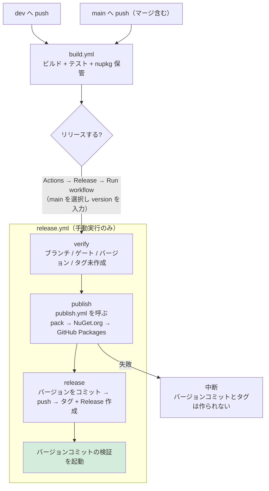

# リリース手順（GitHub Actions）

本ドキュメントは EsUtil.Helper.ZenHanConverter の**リリース作業を行う開発者**向けの情報です。
ライブラリの利用方法は [`../README.md`](../README.md)、詳細仕様は [`../Spec.md`](../Spec.md)、
他のリポジトリへの流用方法は [`REUSING.md`](REUSING.md) を参照してください。

リリースは **手動実行のみ**です。バージョンの**自動インクリメントは行いません**。

## 設計

リリースに関する設定と手順は、次の 3 つに集約しています。**同じ知識を複数箇所に置かない**ことが設計方針です。

| 単一ソース | 内容 |
| --- | --- |
| [`release-config.json`](release-config.json) | プロダクト名、バージョンファイル、ゲートのワークフロー、パッケージの定義、NuGet.org の接続先 |
| [`workflows/publish.yml`](workflows/publish.yml) | pack と公開（NuGet.org / GitHub Packages）の単一実装（`release.yml` が呼ぶ） |
| [`scripts/version.ps1`](scripts/version.ps1) | バージョンの規則（形式・比較・系列・プレリリース判定） |

パッケージの追加・変更は **`release-config.json` の `packages[]` を編集するだけ**です（ワークフローとスクリプトの変更は不要）。

```text
.github/
├── release-config.json        # リリース設定（唯一のリポジトリ固有ファイル）
├── RELEASE.md                 # 本ドキュメント
├── REUSING.md                 # 他のリポジトリへの流用方法
├── scripts/
│   ├── version.ps1            # バージョンの規則（リポジトリ非依存）
│   ├── set-version.ps1        # バージョンファイルの書き換え（冪等）
│   └── verify-release-version.ps1  # リリース可否の検証
└── workflows/
    ├── build.yml              # push / PR でビルド・テスト（登録なし）
    ├── publish.yml            # pack と公開（release.yml から呼ばれる共通ワークフロー）
    └── release.yml            # 手動実行で検証・公開・タグ・Release 作成
```

## ワークフロー

| ワークフロー | 実行契機 | 内容 |
| --- | --- | --- |
| [`workflows/build.yml`](workflows/build.yml) | `main` / `dev` / `release/**` への push、`main` 向け PR、手動 | ビルド・テスト・nupkg の保管（**公開は行わない**） |
| [`workflows/publish.yml`](workflows/publish.yml) | `workflow_call` | pack と公開の単一実装（`version` を受け取るとそのバージョンで pack する） |
| [`workflows/release.yml`](workflows/release.yml) | **手動実行のみ** | 検証 → pack と公開 → バージョンコミット → タグ + GitHub Release 作成 |

`build.yml` の成功実行はリリースの**前提（ゲート）**です。`release.yml` は、リリース対象コミットに対する `build.yml` の成功実行が存在することを確認してから Release を作成します。



## リリース手順

1. `dev` の変更を `main` へマージ（push）する
2. `Actions` → **Build** が成功するまで待つ
3. `Actions` → **Release** → `Run workflow` を開く
4. **実行ブランチに `main` を選び**、`version` にリリースするバージョンを入力して実行する
5. ログの「結果をまとめ」でバージョン・タグ・対象コミットを確認する
6. NuGet.org と GitHub Packages に反映されていることを確認する
   - <https://www.nuget.org/packages/EsUtil.Helper.ZenHanConverter>
   - <https://github.com/tomokuni/EsUtil.Helper.ZenHanConverter/pkgs/nuget/EsUtil.Helper.ZenHanConverter>

## 公開先とその設定

| 公開先 | 認証 | 必要な設定 |
| --- | --- | --- |
| NuGet.org | **Trusted Publishing (OIDC)** | nuget.org のポリシー登録（初回のみ） |
| GitHub Packages | **`GITHUB_TOKEN`** | 不要（`packages: write` 権限を使用） |

**長期 API キーや GitHub Secrets の登録は不要です。**

### NuGet.org の Trusted Publishing ポリシー

1. <https://www.nuget.org/> にサインインする
2. 右上のユーザー名 → **Trusted Publishing** を選択する
3. **Add a new trusted publishing policy** を押下する
4. 次の値を入力する（大文字小文字は区別されません）

   | 項目 | 設定値 |
   | --- | --- |
   | Repository Owner | `tomokuni` |
   | Repository | `EsUtil.Helper.ZenHanConverter` |
   | **Workflow File** | **`publish.yml`** |
   | Environment | （空欄） |

5. **Policy Scopes** で対象パッケージの glob パターン（例: `EsUtil.Helper.ZenHanConverter`）を指定する
6. **Policy Owner** に、パッケージを所有するアカウントを選択する

> **Workflow File に `publish.yml` を指定する理由**
> OIDC トークンを要求するのは `publish.yml`（`release.yml` から呼ばれる再利用ワークフロー）です。
> nuget.org は**トークンを要求したワークフローのファイル名**で検証するため、呼び出し元の `release.yml` ではなく
> `publish.yml` を指定します。
>
> もし OIDC の交換で `401` / `403` になる場合は、ポリシーの **Workflow File を `release.yml` に変更**して
> 再実行してください（検証対象のクレームは環境により異なる場合があります）。

一時 API キーの有効期限は **1 時間**です。`publish.yml` は push の直前にキーを取得します。

### GitHub Packages の可視性

GitHub Packages は **初回公開時の可視性が Private** です。広く配布する場合は、パッケージのページから可視性を Public に変更してください。

> `.csproj` の `<RepositoryUrl>` が本リポジトリを指しているため、パッケージは自動的にリポジトリへリンクされます。
> これによりワークフローはパッケージへの `admin` 権限を自動的に得ます。

## バージョンの指定

semver 形式で入力します。数値部分の**先頭 0 は使用できません**。

| 入力例 | 意味 |
| --- | --- |
| `1.0.1` | 通常のリリース |
| `1.1.0` | 機能追加 |
| `2.0.0` | メジャーリリース |
| `1.2.3-rc.1` | プレリリース（GitHub 上もプレリリースとして登録される） |

プレリリース識別子は `-rc.1` のように**数値をドットで区切る形式を推奨**します。`-rc1` のような形式は辞書順で比較されるため（semver 仕様）、`rc10` が `rc2` より小さくなります。

> **NuGet は同じバージョンを再利用できません。** 一度公開した `<バージョン>` は取り消せないため、
> 修正が必要な場合は次のバージョン（例: `1.0.1` → `1.0.2`）を指定してください。

## 検証される条件

`release.yml` は次をすべて満たさない場合に失敗します。

| # | 条件 | 失敗する例 |
| --- | --- | --- |
| 1 | 実行ブランチが `main` または `release/<major>.<minor>` | `dev` を選んで実行 |
| 2 | 対象コミットに対する `build.yml` の**成功実行がある** | push 直後（Build 実行中・失敗）に実行 |
| 3 | バージョンが semver 形式（先頭 0 不可） | `1.2`、`01.2.3` |
| 4 | `main`: **全タグの最大より大きい** | `v2.0.0` があるのに `1.3.0` を入力 |
| 5 | `release/X.Y`: 入力の系列が `X.Y` に一致し、**`vX.Y.*` の最大より大きい** | `release/1.2` に `1.3.0` を入力 |
| 6 | タグ `v<version>` が**未作成** | 既存と同じバージョンを入力 |

条件 4・5 により、**同値の入力も失敗**します（同じバージョンの再リリースはできません）。

## バックポートリリース

古い系列の保守リリースは、`release/<major>.<minor>` ブランチから実行します。

```text
例: v2.0.0 をリリース済みで、1.0 系に修正を出したい場合

1. release/1.0 ブランチを作成し、修正を cherry-pick する
2. release/1.0 へ push する（Build が成功するまで待つ）
3. Actions → Release → Run workflow で
   実行ブランチに release/1.0 を選び、version に 1.0.1 を入力する
```

| 実行ブランチ | 比較対象 | 例（タグ: v1.0.1 / v2.0.0） |
| --- | --- | --- |
| `main` | **全タグ**の最大 | `2.0.1` は OK / `1.1.0` は失敗（誤った系列への逆戻りを防ぐ） |
| `release/1.0` | `v1.0.*` の最大 | `1.0.2` は **OK（バックポート）** / `1.0.1` は失敗（同値） |

バックポートでは次を自動で行います。

- `--latest=false`（古い系列を Latest にしない）
- `--notes-start-tag v1.0.1`（リリースノートの範囲を系列内に限定）

## Release の添付ファイル

`publish.yml` が pack した nupkg を、そのまま GitHub Release へ添付します。添付するファイルは `release-config.json` の `packages[]` が決めるため、**パッケージを追加してもワークフローは変更不要**です。

## 失敗した場合の復旧

`release.yml` は **公開（NuGet.org / GitHub Packages）の成功後にバージョンコミットとタグ作成**を行います。そのため、公開に失敗してもタグと Release は作成されません。

| 失敗したジョブ | 状態 | 復旧方法 |
| --- | --- | --- |
| `verify` | 何も変更されていない | 条件を満たして再実行する |
| `publish`（pack 前） | 何も変更されていない | **同じバージョンで再実行**する |
| `publish`（公開の途中） | NuGet.org に公開済みの可能性あり | **同じバージョンで再実行**する（`--skip-duplicate` により公開済みはスキップされ、未完了分だけが進む） |
| `release`（push 後） | ブランチは push 済み・タグ未作成 | **同じバージョンで再実行**する（バージョン設定が冪等なため再試行できる） |

- 失敗した実行を「Re-run」しても**その実行時のワークフロー定義**が使われるため、定義を修正した場合は再実行せず、新しく `Run workflow` してください。
- `release` ジョブがバージョンをコミットした後に失敗した場合、ブランチの先頭コミットが変わるため**ゲート（条件 2）が未充足**になります。`Actions` → **Build** の成功を待ってから再実行してください。

## リリース後の検証（バージョンコミット）

リリース時のバージョン更新コミットは `GITHUB_TOKEN` による push のため、`build.yml` が自動では起動しません（`GITHUB_TOKEN` の push はワークフローを起動しない）。
そこで `release.yml` が push 後に [`gh workflow run`](https://docs.github.com/en/rest/actions/workflows) で `build.yml` の検証を起動します（`workflow_dispatch` は例外として起動できる）。

- バージョンコミットにもチェックが付き、**テストが実行される**（リリースされたコミットが未検証にならない）。
- 検証が成功すると、そのコミットが次のリリースのゲートを満たす。**リリース直後でも続けて次のリリースが可能**。
- 検証の起動は非同期です（完了は待ちません）。結果は `Actions` → Build で確認してください。

## ローカルでの確認

スクリプトはローカルでも実行できます。

```powershell
# バージョンを設定する（バージョンファイルを更新。冪等）
& ./.github/scripts/set-version.ps1 -Version 1.0.1 -VersionFile src/ZenHanConverter.csproj

# リリース可否を事前確認する（形式・系列・単調性・タグ未作成）
$info = & ./.github/scripts/verify-release-version.ps1 -Version 1.0.1 -Branch main | ConvertFrom-Json
$info.tag           # -> v1.0.1
$info.notesStartTag # -> v1.0.0
$info.prerelease    # -> False

# パイプラインの確認（CI と同一のコマンド）
dotnet restore ZenHanConverter.slnx
dotnet build ZenHanConverter.slnx -c Release --no-restore
dotnet test ZenHanConverter.slnx -c Release --no-build
```

バージョンの規則（形式・比較）だけを確認する場合は、ライブラリを直接使えます。

```powershell
. ./.github/scripts/version.ps1
ConvertTo-SemanticVersion -Version '1.2.3-rc.1'   # 不正なら例外
Get-VersionSeries -Version '1.2.3'                # -> 1.2
Get-MaxVersion -Versions @('1.0.0', '1.2.0')      # -> 1.2.0
```

## README のバッジについて

| バッジ | 種類 | 備考 |
| --- | --- | --- |
| `release` | 動的（shields.io） | GitHub Release の最新タグを表示 |
| `nuget` | 動的（shields.io） | NuGet.org の最新バージョンを表示 |
| `GitHub Packages` | **静的** | 手動更新が必要（下記） |
| `build` | 動的 | `build.yml` の状態を表示 |

GitHub Packages には公式バッジが存在せず、パッケージ情報を返す REST API は **認証必須**です（未認証では `401 Unauthorized`）。
shields.io の `dynamic/json` も認証情報を持てないため値を取得できません（`invalid` と表示されます）。
そのため shields.io の静的バッジを使用しています。**バージョンアップ時は次の箇所を更新してください。**

```text
https://img.shields.io/badge/GitHub%20Packages-v1.0.0-2ea44f?logo=github
                                                 ^^^^^^^ ここを新しいバージョンへ
```

## 注意点

- ワークフローが `main`（または `release/X.Y`）へ push するため、**ブランチ保護**で `github-actions[bot]` の push が拒否される場合は許可設定（または PAT への切り替え）が必要です。
- `release.yml` は `actions: write` 権限を使用します（ゲートの参照と、バージョンコミットの検証の起動）。
- `build.yml` は `main` / `dev` / `release/**` への push のたびにビルド・テストし、nupkg を保管します（ドキュメントのみの変更でも実行されます）。公開は行わないため、push で NuGet.org が更新されることはありません。
- アーティファクトの保持期間は `release-config.json` の `artifactRetentionDays`（既定 30 日）です。リリース時に改めて pack するため、保管はゲートの記録と確認用です。
- `release.yml` の `publish` と `release` は別ジョブのため、バージョンは 2 回適用されます（publish は作業ツリーのみ、release はコミット）。どちらも冪等で、同一の入力から同一の成果物になります。
